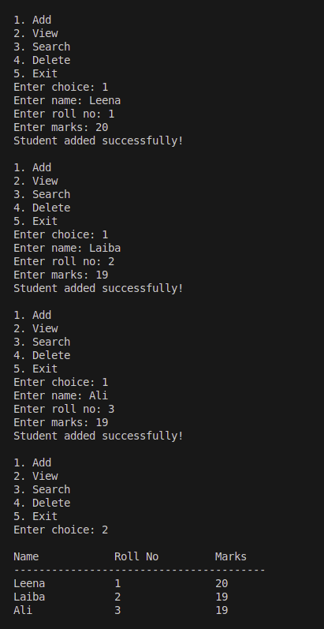

# 🎓 Student Management System

A **simple and interactive Python program** to manage student records. Keep track of students’ names, roll numbers, and marks using a clean command-line interface.  

---

## ✨ Features

- ✅ Add new students with **name**, **roll number**, and **marks**.  
- ✅ View all students in a **tabular format**.  
- ✅ Search students by **roll number**.  
- ✅ Delete students by **roll number**.  
- ✅ Easy-to-use menu for **quick navigation**.  

---

## 🖼️ Sample Output

Here’s a screenshot of the program in action:



---

## 🛠️ Requirements

- Python 3.x installed on your system.  
- No external libraries required.  

---

## 🚀 How to Use

1. Download or clone the repository.  
2. Run the Python script:

```bash
python student_management.py
